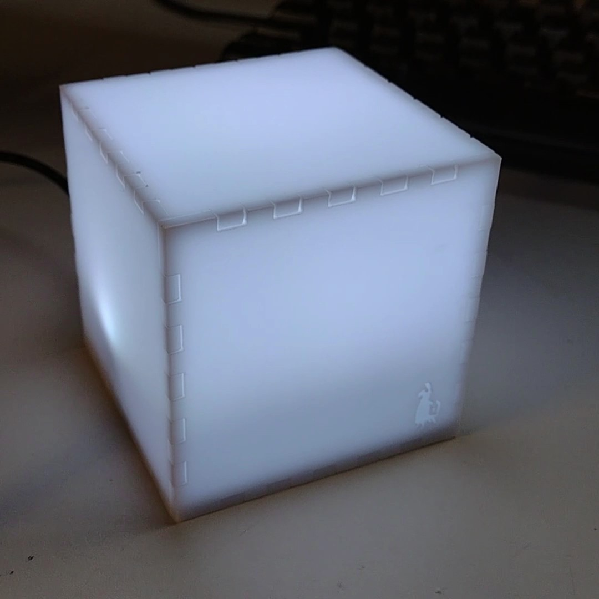

# The cube

The cube is a physical device which connects to the internet and lights up when you win (or don't) playing [FortNite](https://www.epicgames.com/fortnite/en-US/home).

Created by [Martin O'Hanlon](https://github.com/martinohanlon) [@martinohanlon](https://twitter.com/martinohanlon), [stuffaboutco.de](https://stuffaboutco.de).

## Design

The fortnite cube uses a Raspberry Pi Zero with a pimoroni blinkt and a single toggle switch.

The cube is laser cut from white opal acrylic - the svg is [here](docs/resources/cube.svg).

The Raspberry Pi Zero sits inside a 3d printed frame - the stl is [here](docs/resources/cube_base.stl)

## Code

A python program, [fortnitecube.py](thecube/fortnitecube.py) controls the cube, connecting to [fortnitetracker.com](https://fortnitetracker.com) once every 60 seconds when turned on (via a switch at the back of the cube) and controls the LEDs inside based on changing player stats (e.g. flashing colours when the number of wins increases).

A `constants.py` file should be added containing a [fortnitetracker.com API Key](https://fortnitetracker.com/site-api) and the players name in the format.

~~~python
FNT_API_KEY = "api key"
FN_PLAYER = "players name"
~~~

## Status 

In active development.
